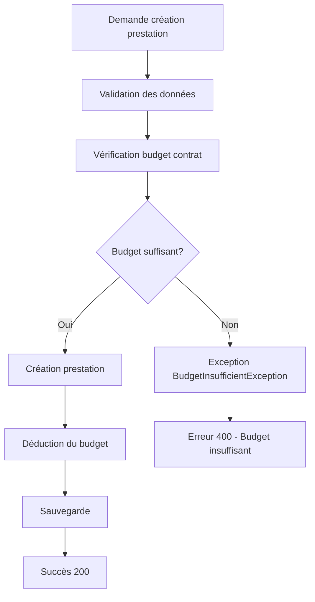
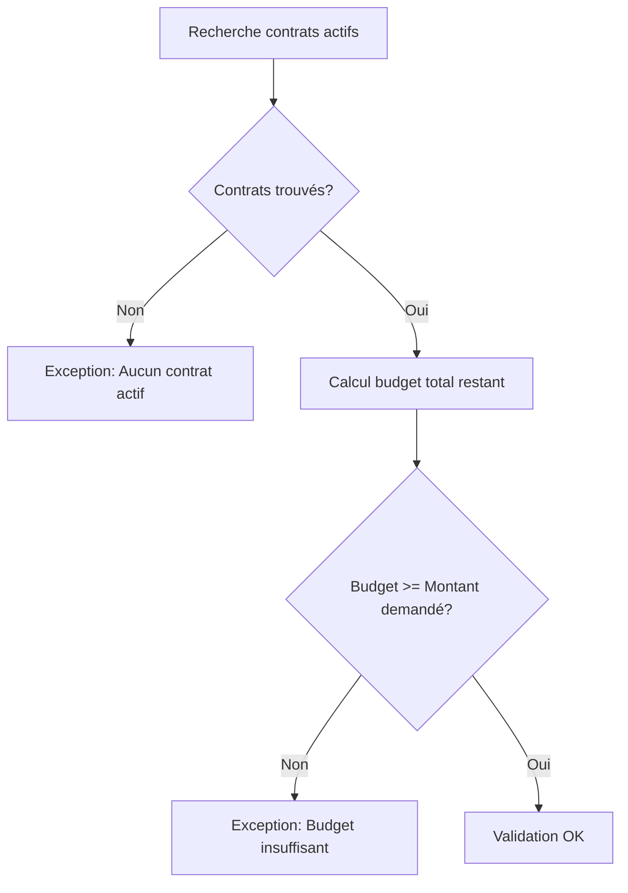

# Gestion du Budget des Contrats

## Vue d'ensemble

Cette fonctionnalité implémente un système de gestion du budget des contrats qui empêche les prestataires de créer des prestations lorsque leur budget contractuel est épuisé.

## Fonctionnalités

### 1. Suivi du Budget Restant

- **Nouveau champ** : `montant_restant` ajouté à la table `contrats`
- **Initialisation automatique** : Le montant restant est initialisé avec le montant total du contrat
- **Déduction automatique** : Le montant des prestations est automatiquement déduit du budget restant

### 2. Vérification Avant Création

Avant de créer une prestation, le système vérifie :
- ✅ **Budget disponible** : Le prestataire a-t-il suffisamment de budget ?
- ✅ **Contrats actifs** : Y a-t-il des contrats actifs pour ce prestataire ?
- ✅ **Montant valide** : Le montant de l'intervention est-il positif ?

### 3. Blocage Automatique

Si le budget est insuffisant :
- ❌ **Création bloquée** : La prestation ne peut pas être créée
- 📧 **Message d'erreur** : Message explicite avec détails du budget
- 🔄 **Rollback** : Aucune modification n'est effectuée en base

### 4. Notifications Automatiques 🆕

Le système envoie automatiquement des notifications au prestataire :

#### 🚫 Budget Insuffisant
- **Quand** : Tentative de création avec budget insuffisant
- **Message** : Détails du budget restant et montant demandé
- **Action** : Contacter l'administration

#### 🔴 Budget Épuisé (0%)
- **Quand** : Budget complètement épuisé après une prestation
- **Message** : "URGENT: Budget contractuel épuisé"
- **Action** : Contact immédiat requis pour renouvellement

#### ⚠️ Budget Critique (< 10%)
- **Quand** : Moins de 10% du budget restant
- **Message** : "URGENT: Budget critique"
- **Action** : Préparation urgente du renouvellement

#### 🟡 Budget Faible (< 25%)
- **Quand** : Moins de 25% du budget restant
- **Message** : "Info: Budget faible"
- **Action** : Planification recommandée

## Implémentation Technique

### Modèle de Données

```sql
-- Nouveau champ ajouté à la table contrats
ALTER TABLE contrats ADD COLUMN montant_restant DOUBLE;

-- Initialisation pour les contrats existants
UPDATE contrats SET montant_restant = montant WHERE montant_restant IS NULL;
```

### Services Modifiés

#### PrestationService
- `checkContractBudgetAvailability()` : Vérifie le budget avant création
- `deduireMonantContrat()` : Déduit le montant après création réussie

#### ContratService (Nouveau)
- `initialiserMontantsRestants()` : Initialise les budgets existants
- `getBudgetTotalRestant()` : Calcule le budget total restant
- `hasSufficientBudget()` : Vérifie si le budget est suffisant

### Exceptions

#### BudgetInsufficientException (Nouvelle)
Exception personnalisée levée quand le budget est insuffisant :
```java
throw new BudgetInsufficientException(
    "Budget insuffisant. Montant demandé: 50000 FCFA, Budget restant: 30000 FCFA",
    50000.0, 30000.0
);
```

## API Endpoints

### Gestion des Budgets

#### Initialiser les budgets
```http
POST /api/contrats/initialiser-budgets
Authorization: Bearer <admin-token>
```

#### Vérifier le budget d'un prestataire
```http
GET /api/contrats/budget/{prestataireContact}
Authorization: Bearer <token>
```

#### Vérifier si une prestation peut être créée
```http
GET /api/contrats/budget/{prestataireContact}/verifier?montant=50000
Authorization: Bearer <token>
```

### Création de Prestation (Modifiée)

```http
POST /api/prestations
Content-Type: application/json
Authorization: Bearer <prestataire-token>

{
  "contactPrestataire": "prestataire@example.com",
  "montantIntervention": 50000,
  "nomPrestataire": "Nom du Prestataire",
  // ... autres champs
}
```

**Réponses possibles :**
- ✅ `200 OK` : Prestation créée avec succès
- ❌ `400 Bad Request` : Budget insuffisant
- ❌ `400 Bad Request` : Erreur de validation

## Flux de Traitement

### 1. Création de Prestation



### 2. Vérification Budget



## Configuration et Déploiement

### 1. Migration Base de Données

Exécuter le script SQL :
```bash
mysql -u username -p database_name < add_montant_restant_field.sql
```

### 2. Initialisation des Budgets

Après déploiement, initialiser les budgets existants :
```bash
curl -X POST http://localhost:8080/api/contrats/initialiser-budgets \
  -H "Authorization: Bearer <admin-token>"
```

### 3. Vérification

Vérifier qu'un prestataire a des contrats actifs :
```bash
curl http://localhost:8080/api/contrats/budget/prestataire@example.com \
  -H "Authorization: Bearer <token>"
```

## Gestion des Erreurs

### Messages d'Erreur

#### Budget Insuffisant
```json
{
  "code": "BUDGET_INSUFFICIENT",
  "message": "Budget insuffisant. Montant demandé: 50000.00 FCFA, Budget restant: 30000.00 FCFA"
}
```

#### Aucun Contrat Actif
```json
{
  "code": "VALIDATION_ERROR",
  "message": "Aucun contrat actif trouvé pour le prestataire: prestataire@example.com"
}
```

### Logs

Le système génère des logs détaillés :
```
🔍 Vérification du budget contrat pour prestataire prestataire@example.com - montant: 50000
💰 Budget total restant: 30000.0 FCFA pour 2 contrats
❌ Budget insuffisant. Montant demandé: 50000.00 FCFA, Budget restant: 30000.00 FCFA
```

## Tests

### Test Manuel

1. **Créer un contrat** avec un montant de 100 000 FCFA
2. **Créer une prestation** de 60 000 FCFA → ✅ Succès + 🟡 Notification budget faible
3. **Vérifier le budget restant** → 40 000 FCFA
4. **Créer une prestation** de 35 000 FCFA → ✅ Succès + ⚠️ Notification budget critique
5. **Créer une prestation** de 10 000 FCFA → ❌ Échec + 🚫 Notification budget insuffisant

### Test des Notifications

```bash
# Tester les notifications de budget
curl -X POST "http://localhost:8080/api/contrats/test-notification-budget?prestataireContact=test@example.com&montantTest=50000" \
  -H "Authorization: Bearer <admin-token>"
```

### Test Automatisé

```java
@Test
public void testBudgetInsufficientException() {
    // Arrange
    String prestataire = "test@example.com";
    BigDecimal montantTropEleve = new BigDecimal("150000");
    
    // Act & Assert
    assertThrows(BudgetInsufficientException.class, () -> {
        prestationService.checkContractBudgetAvailability(prestataire, montantTropEleve);
    });
}
```

## Sécurité

- ✅ **Autorisation** : Seuls les prestataires authentifiés peuvent créer des prestations
- ✅ **Validation** : Tous les montants sont validés côté serveur
- ✅ **Transactions** : Utilisation de transactions pour garantir la cohérence
- ✅ **Audit** : Logs détaillés de toutes les opérations budgétaires
- ✅ **Notifications sécurisées** : Seul le prestataire concerné reçoit ses notifications

## Maintenance

### Surveillance

Surveiller les métriques suivantes :
- Nombre de prestations bloquées par budget insuffisant
- Évolution des budgets restants par prestataire
- Erreurs de déduction de budget
- Notifications envoyées par type et prestataire
- Taux de renouvellement des contrats après notifications

### Résolution de Problèmes

#### Budget incohérent
```sql
-- Recalculer le budget restant manuellement
UPDATE contrats c SET montant_restant = (
    c.montant - COALESCE((
        SELECT SUM(p.montant_intervention) 
        FROM prestations p 
        WHERE p.contact_prestataire = c.nom_prestataire 
        AND p.statut_validation = 'VALIDE'
    ), 0)
) WHERE c.id = ?;
```

#### Réinitialisation complète
```bash
curl -X POST http://localhost:8080/api/contrats/initialiser-budgets \
  -H "Authorization: Bearer <admin-token>"
```

## Notifications

### Types de Notifications

| Situation | Seuil | Type | Urgence | Action Requise |
|-----------|-------|------|---------|----------------|
| Budget insuffisant | Tentative création | 🚫 ERROR | Immédiate | Impossible de créer |
| Budget épuisé | 0% | 🔴 URGENT | Critique | Renouvellement immédiat |
| Budget critique | < 10% | ⚠️ WARNING | Élevée | Préparation renouvellement |
| Budget faible | < 25% | 🟡 INFO | Modérée | Planification |

### Contenu des Notifications

Chaque notification contient :
- 📊 **État du budget** : Montant restant et pourcentage
- 📋 **Détails des contrats** : Liste des contrats actifs
- 📞 **Informations de contact** : Comment contacter l'administration
- 🎯 **Actions recommandées** : Étapes suivantes à suivre

### Réception des Notifications

Les notifications sont envoyées :
- 🔔 **En temps réel** : Via WebSocket/SSE dans l'interface
- 💾 **Persistantes** : Sauvegardées en base de données
- 📱 **Consultables** : Dans le panneau de notifications de l'utilisateur